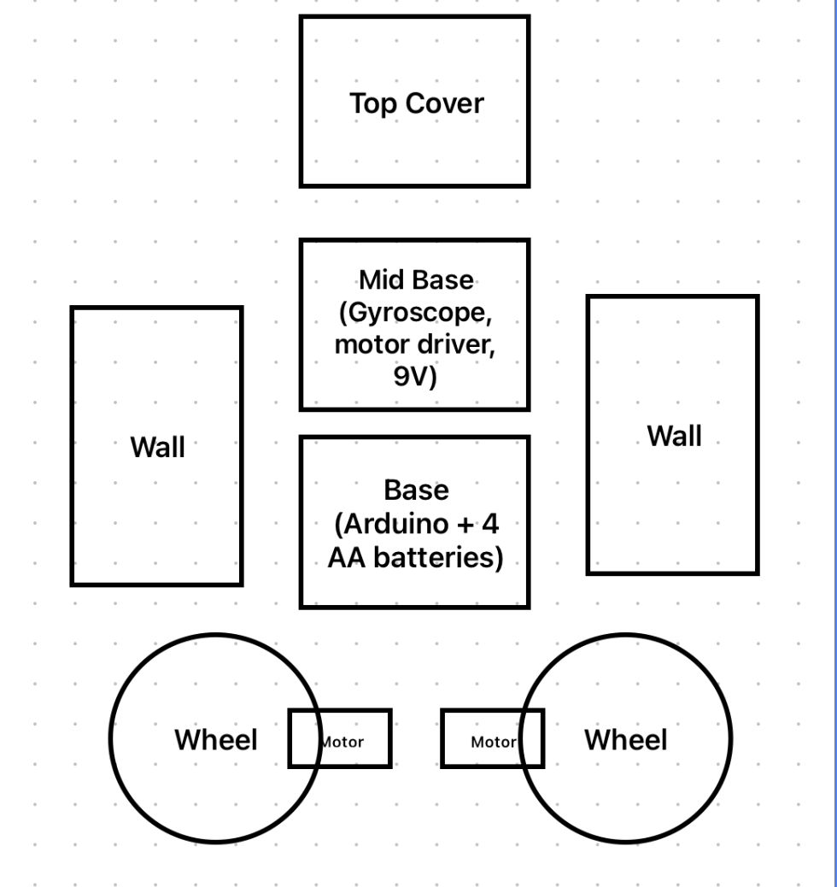
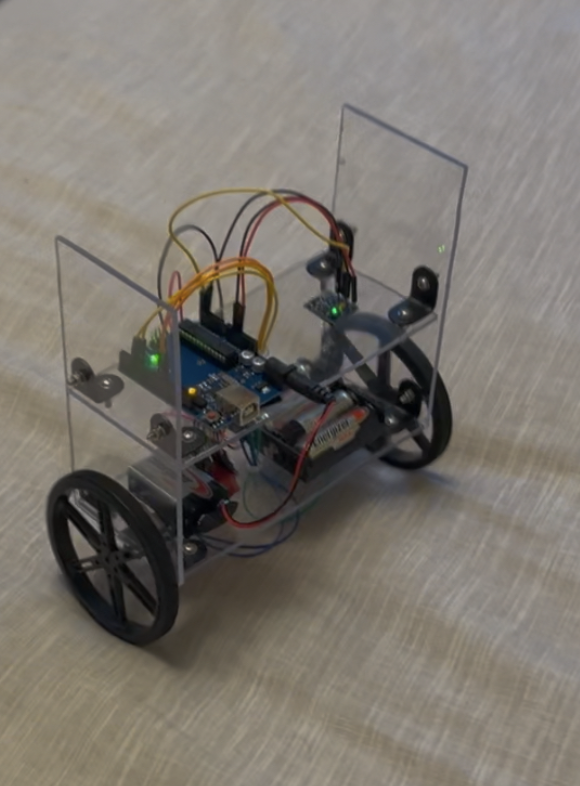
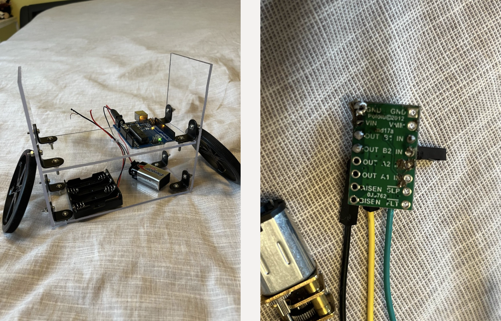

# Gyroscope Robot: Self-Balancing Two-Wheeled Robot  

## Overview  
This project is a self-balancing two-wheeled robot built with an **Arduino Uno**, **MPU6050 gyroscope/accelerometer**, and a **PID controller**. The robot uses real-time sensor feedback to maintain balance dynamically, similar to how hoverboards or Segways operate.  

This project was originally built as part of a physics exploration into **rotational dynamics, Newton’s laws, and feedback control systems**, and later expanded into a working robotics prototype.  

[▶️ Demo Video on YouTube](https://www.youtube.com/shorts/jFM6bGMcFYE)  

---

## Features  
- Balances itself upright using gyroscope and accelerometer data  
- Implements a **PID controller** (Proportional–Integral–Derivative) for fine control of tilt corrections  
- Uses **DC motors with a motor driver** to apply torque and counteract tilt  
- Designed with a lightweight polycarbonate frame for stability  
- Demonstrates real-world applications of feedback control (hoverboards, prosthetics, robotics)  

---

## Hardware  

### Parts List  
- Arduino Uno  
- MPU6050 Gyroscope + Accelerometer  
- Pololu DRV8833 Dual Motor Driver  
- 2 × N20 Micro Metal Gear Motors (6V, 200 RPM, 1.02 kgfcm torque)  
- 90mm Pololu Wheels  
- 9V Battery + 4 × AA Battery Holder  
- Polycarbonate sheet (frame)  
- Brackets, M3 bolts, jumper wires  
- Soldering kit  

### Wiring  

	•	A 9V battery supplied power to the Arduino, while a separate AA battery pack powered the motor driver and motors.
	•	The MPU6050 gyroscope/accelerometer was connected to the Arduino to provide real-time motion data, including angular velocity and tilt angle.
	•	The motor driver was wired to both the Arduino and the motors: it received control signals from the Arduino and adjusted motor speeds based on the robot’s tilt (using proportional, integral, and derivative feedback from the PID controller).
---

## Build & Assembly  

### Frame Design  
The frame was cut from **1/8” polycarbonate sheets**, with walls and stacked layers for electronics.  
- **Bottom layer:** Arduino Uno + 4AA battery pack  
- **Middle layer:** Motor driver + gyroscope module + 9V battery  
- **Top layer:** Cover for stability  

  

### Photos  
  
  

---

## Control System  

### PID Controller  
The robot uses a PID loop to stay balanced:  
- **Proportional (Kp):** Corrects based on current tilt angle  
- **Integral (Ki):** Accounts for accumulated tilt error over time  
- **Derivative (Kd):** Predicts future error by damping fast changes  

This allows the robot to adjust motor speed dynamically and stay upright.  

---

## Applications  
- Hoverboards and Segways  
- Bipedal robots  
- Prosthetic limbs with balance control  
- Industrial automation requiring feedback stability  

---

## Future Improvements  
- Add gesture control using an external IMU  
- Implement Bluetooth remote control  
- Upgrade motor torque for better movement  
- Improve center-of-mass adjustment for stability  

---

## Media  
- [YouTube Demo](https://www.youtube.com/shorts/jFM6bGMcFYE)  
- Project photos in `/images` folder  

---
